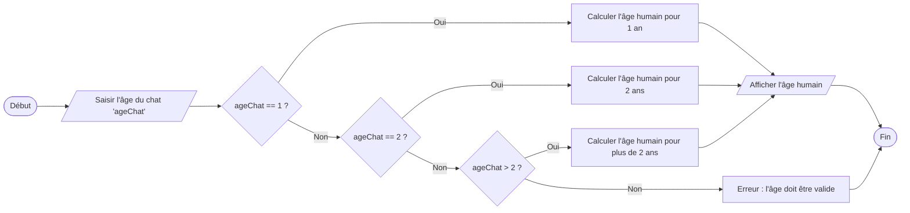

---
hide:
    - navigation
    - toc
title: Les instructions conditionnelles
---

# Exercice 1 : Âge des chats 🐈

Le but de cet exercice est de créer un convertisseur d'âge de chat pour trouver l'âge d'un chat en « années humaines ».

Ceci est très utile pour mieux comprendre les chats et les soins dont ils ont besoin et pour savoir à quel stade de la vie se trouve un chat.

Pour convertir l'âge d'un chat en années humaines, il est nécessaire de réaliser les étapes suivantes :

- La première année du chat compte pour 15 ans en âge humain
- La deuxième année compte pour 9 ans en âge humain
- Chaque année supplémentaire compte pour 4 ans en âge humain

Par exemple :

- Un chat d'un an a 15 ans en âge humain,
- Un chat de 2 ans a 15 + 9 = 24 en âge humain,
- Un chat de 3 ans a 15 + 9 + 4 = 28 en âge humain,
- Un chat de 4 ans est 15 + 9 + 4 + 4 = 32 en âge humain,
- Un chat de 5 ans est 15 + 9 + 4 + 4 + 4= 36 en âge humain,
- Un chat de 10 ans est 15 + 9 + 4 + 4 + 4 + 4 + 4 + 4 + 4 + 4 = 56 en âge humain.

??? question "Question 1"

    🐍 **Question 1** : Compléter le code ci-dessous pour qu'il renvoie l'age correct du chat si celui-ci à plus de 2 ans.

    {{IDE('exo1_q1', MAX=1000)}}

Les étapes de la vie d'un chat sont les suivantes :

- Chaton - de la naissance à 6 mois,
- Junior - de 7 mois à 2 ans,
- Adulte - de 3 ans à 6 ans,
- Mûr - de 7 ans à 10 ans,
- Senior - de 11 à 14 ans,
- Gériatrique - à partir de 15 ans.

??? question "Question 2"

    🐍 **Question 2** : Copier le code précédent et modifier le pour indiquer à quelles étapes de la vie du chat son âge correspond.

    {{IDE('exo1_q2', MAX=1000)}}

Pour la prochaine question, vous aurez besoin du tableau suivant: 

<table border="1" cellspacing="0" cellpadding="5">
    <tr>
        <th>Stade de vie</th>
        <th>Âge du chat</th>
        <th>Âge humain</th>
    </tr>
    <tr>
        <td rowspan="5">Chaton</td>
        <td>2 mois</td>
        <td>9 à 10 mois</td>
    </tr>
    <tr>
        <td>3 mois</td>
        <td>2 à 3 ans</td>
    </tr>
    <tr>
        <td>4 mois</td>
        <td>5 à 6 ans</td>
    </tr>
    <tr>
        <td>5 mois</td>
        <td>8 à 9 ans</td>
    </tr>
    <tr>
        <td>6 mois</td>
        <td>10 ans</td>
    </tr>
    <tr>
        <td rowspan="3">Junior</td>
        <td>8 mois</td>
        <td>13 ans</td>
    </tr>
    <tr>
        <td>1 an</td>
        <td>15 ans</td>
    </tr>
    <tr>
        <td>2 ans</td>
        <td>24 ans</td>
    </tr>
    <tr>
        <td rowspan="4">Adulte</td>
        <td>3 ans</td>
        <td>28 ans</td>
    </tr>
    <tr>
        <td>4 ans</td>
        <td>32 ans</td>
    </tr>
    <tr>
        <td>5 ans</td>
        <td>36 ans</td>
    </tr>
    <tr>
        <td>6 ans</td>
        <td>40 ans</td>
    </tr>
    <tr>
        <td rowspan="4">Mûr</td>
        <td>7 ans</td>
        <td>44 ans</td>
    </tr>
    <tr>
        <td>8 ans</td>
        <td>48 ans</td>
    </tr>
    <tr>
        <td>9 ans</td>
        <td>52 ans</td>
    </tr>
    <tr>
        <td>10 ans</td>
        <td>56 ans</td>
    </tr>
    <tr>
        <td rowspan="4">Sénior</td>
        <td>11 ans</td>
        <td>60 ans</td>
    </tr>
    <tr>
        <td>12 ans</td>
        <td>64 ans</td>
    </tr>
    <tr>
        <td>13 ans</td>
        <td>68 ans</td>
    </tr>
    <tr>
        <td>14 ans</td>
        <td>72 ans</td>
    </tr>
    <tr>
        <td rowspan="7">Gériatrique</td>
        <td>15 ans</td>
        <td>76 ans</td>
    </tr>
    <tr>
        <td>16 ans</td>
        <td>80 ans</td>
    </tr>
    <tr>
        <td>17 ans</td>
        <td>84 ans</td>
    </tr>
    <tr>
        <td>18 ans</td>
        <td>88 ans</td>
    </tr>
    <tr>
        <td>19 ans</td>
        <td>92 ans</td>
    </tr>
    <tr>
        <td>20 ans</td>
        <td>96 ans</td>
    </tr>
    <tr>
        <td>21 ans et plus</td>
        <td>100 ans</td>
    </tr>
</table>

??? question "Question 3"

    🐍 **Question 3** : Créer un programme où l'utilisateur entre son âge humain et qui lui indique son âge s'il était un chat

    {{IDE('exo1_q3', MAX=1000)}}