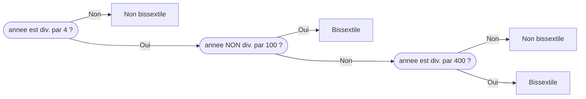

---
hide:
    - navigation
    - toc
title: Années bissextiles

---

Les années bissextiles comportent 366 jours. Contrairement à ce que l'on pense couramment, elles ne se rencontrent pas exactement tous les 4 ans !

En effet :

* une année non divisible par 4 n'est pas bissextile,
* parmi les années divisibles par 4 :
    * les années qui ne sont pas divisibles par 100 sont bissextiles,
    * parmi les années divisibles par 100 :
        * les années qui ne sont pas divisibles par 400 ne sont pas bissextiles,
        * les autres sont bissextiles.



Par exemple :

* 2026 n'est pas divisible par 4 : elle n'est pas bissextile ;
* 2020 est divisible par 4, mais pas par 100 : elle est bissextile ;
* 2100 est divisible par 4, par 100, mais pas par 400 : elle n'est pas bissextile ;
* 2400 est divisible par 4, par 100 et par 400 : elle est bissextile.

??? tip "Aide - Tester la divisibilité avec Python"

    Avec Python, il est possible de tester la divisibilité de `a` par `b` en utilisant l'opérateur "modulo" `#!py %` qui renvoie le reste de la division euclidienne de `a` par `b`.

    Si ce reste vaut `#!py 0` alors `a` est divisible par `b`. Dans le cas contraire, `a` n'est pas divisible par `b`.

    ```pycon
    >>> # 15 est-il divisible par 3 ? -> Oui
    >>> 15 % 3 == 0
    True
    >>> # 500 est-il divisible par 7 ? -> Non
    >>> 500 % 7 == 0
    False
    >>> # 500 est-il NON divisible par 7 ? -> Oui
    >>> 500 % 7 != 0
    True
    ```

Compléter la fonction `est_bissextile` ci-dessous renvoyant `#!py True` si l'année passée en argument est bissextile, `#!py False` dans le cas contraire.

???+ example "Exemples"

    ```pycon title=""
    >>> est_bissextile(2022)
    False
    >>> est_bissextile(2020)
    True
    >>> est_bissextile(2100)
    False
    >>> est_bissextile(2400)
    True
    ```
{{ IDE('exo',MAX=1000) }}