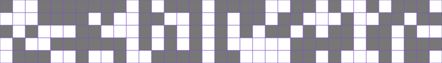
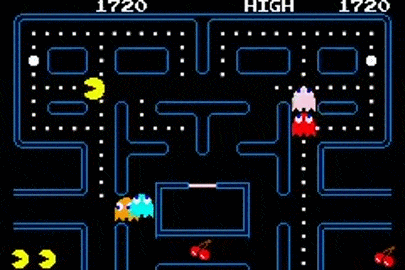

---
hide:
    - navigation
    - toc
title: La fourmi dressée
---

Dans un cirque, un dresseur est fier de présenter la fourmi la plus intelligente du monde : elle sait écrire !

La fourmi se déplace sur une grille en deux dimensions. Chaque case de la grille est une tuile comportant deux faces : une *blanche* et une *grise* Initialement, le tuiles sont placées comme sur la figure ci-dessous :

{width=75% .center}

À chaque instant, la fourmi se trouve sur une tuile donnée, repérée par ses coordonnées $x$ (horizontalement) et $y$ (verticalement), l'origine étant la tuile en haut à gauche. Elle est de plus orientée dans une certaine direction : vers le haut, la droite, le bas ou la gauche.

**Initialement, la fourmi est en $\left(x~;~y\right)=\left(28~;~0\right)$ et regarde vers la gauche.**

À chaque étape, la fourmi exécute les actions suivantes :

* si elle se trouve :
    * sur une tuile blanche, elle pivote sur elle même d'un quart de tour vers la **droite** ;
    * sur une tuile grise, elle pivote sur elle même d'un quart de tour vers la **gauche** ;
* ensuite, elle **retourne** la tuile sur laquelle elle est placée ;
* enfin, elle **avance** d'une tuile.

Le dresseur a bien réfléchi son numéro : si la fourmi exécute $500$ fois les actions décrites ci-dessus, alors son nom apparaîtra sur le terrain de jeu.

??? note "Le monde est un tore !"

    Le terrain de jeu de la fourmi est très particulier : si elle sort du terrain par un côté, elle rentre immédiatement sur le terrain par le côté d'en face.

    

    {width=100%} {width=65%}
    

    Ce type de terrain ressemble, par certains aspects, à un [tore](https://fr.wikipedia.org/wiki/Tore){ target="_blank" }, un solide ayant la forme d'un *donut*. Beaucoup de « mondes » de jeux vidéos sont toroïdaux !

Vous devez compléter le script ci-dessous qui permet de simuler le numéro. Vous devez donc, dans un premier temps :

* placer la fourmi sur la bonne case de départ (variables `#!py x` et `#!py y`) ;
* l'orienter correctement (variable `#!py o` qui doit prendre l'une des valeurs `#!py HAUT`, `#!py DROITE`, `#!py BAS` ou `#!py GAUCHE`) ;
* indiquer le bon nombre d'étapes à réaliser (variable `#!py nb_etapes`) ;

Ces premiers réglages effectués, vous devez compléter la fonction `#!py etape`. Cette fonction prend trois paramètres `#!py x`, `#!py y` et `#!py o` qui décrivent la position et l'orientation actuelle de la fourmi. Cette fonction simule une étape de déplacement et renvoie les nouvelles valeurs de `#!py x`, `#!py y` et `#!py o`.

Vous devrez utiliser les fonctions décrites dans le tableau ci-dessous :

| Appel de fonction               | Paramètres                                                                           | Rôle                                                                                              |
| :------------------------------ | :----------------------------------------------------------------------------------- | :------------------------------------------------------------------------------------------------ |
| `#!py o = droite(o)`            | L'orientation actuelle de la fourmi `#!py o`                                         | Fait pivoter la fourmi vers la droite et renvoie la nouvelle orientation                          |
| `#!py o = gauche(o)`            | L'orientation actuelle de la fourmi `#!py o`                                         | Fait pivoter la fourmi vers la gauche et renvoie la nouvelle orientation                          |
| `#!py c = couleur_tuile(x, y)`  | Les coordonnées `#!py x` et `#!py y` de la fourmi                                    | Renvoie la couleur de la tuile sur la quelle se trouve la fourmi (soit `#!py BLANC`, soit `#!py GRIS`) |
| `#!py retourne_tuile(x, y)`     | Les coordonnées `#!py x` et `#!py y` de la fourmi                                    | Retourne la tuile sur laquelle se trouve la fourmi. Ne renvoie rien                                                |
| `#!py x, y = avance(x, y, o)`   | Les coordonnées et l'orientation actuelle de la fourmi `#!py x`,`#!py y` et `#!py o` | Fait avancer la fourmi d'un pas et renvoie ses nouvelles coordonnées                              |

L'appel `#!py lance_simulation()` permet de... lancer la simulation ! **Cette ligne ne doit pas être modifiée.**

{{ IDE('pythons/exo', STD_KEY="oospy") }}

{{ figure("langton", p5_buttons='left', admo_title="La fourmi" ) }}
