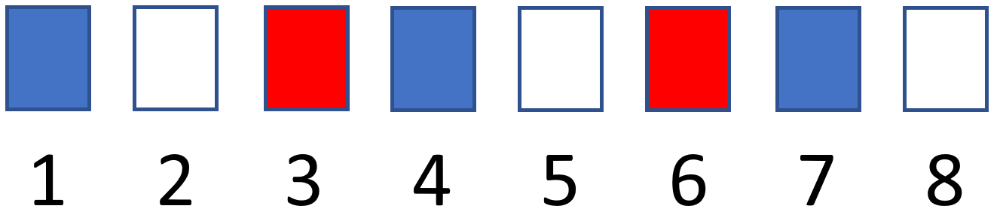

La mairie d'une commune a décidé d'organiser un spectacle en plein air pour le 1er août. Pour cela, elle va faire appel à de nombreux figurants et distribuer à chacun d'eux un costume bleu, ou blanc, ou rouge. Ne sachant pas à l'avance combien de personnes vont se présenter, l'organisateur du spectacle a décidé, afin d'équilibrer à peu près les couleurs, de procéder de la façon suivante : le premier figurant arrivé recevra un costume bleu, le second un blanc, le troisième un rouge, le quatrième un bleu, le cinquième un blanc, etc.  

{ width=35% .center}

Constatant le succès de la fête du 1er août, la mairie a décidé d'organiser d'autres spectacles de ce genre, avec distribution de costumes sur le même principe. Chaque spectacle a des costumes spécifiques.

Nicolas fait la queue pour recevoir son maillot. Curieux et impatient, il se demande de quelle couleur il sera. Il sait juste où il se trouve dans la file (son rang) et les couleurs des maillots distribués (la liste couleurs).

Pouvez-vous l'aider à déterminer la couleur de son maillot ?

Compléter la fonction `costume` ci-dessous. Elle prend en paramètre `rang` qui est le rang d'arrivée du figurant, et `couleurs` qui est la liste des couleurs des costumes. Elle doit renvoyer la couleur du costume donné au figurant correspondant.
On garantit que la liste `couleurs` n'est pas vide, que `rang` est un entier supérieur ou égal à 1, et qu'on dispose de suffisemment de costumes pour tout le monde.

???+ example "Exemples"

    ```pycon title=""
    >>> costume(2, ["bleu", "blanc", "rouge"])
    'blanc'
    >>> costume(8, ["rose", "vert", "orange", "bleu"])
    'bleu'
    ```


{{ IDE('exo', MAX=1000) }}
