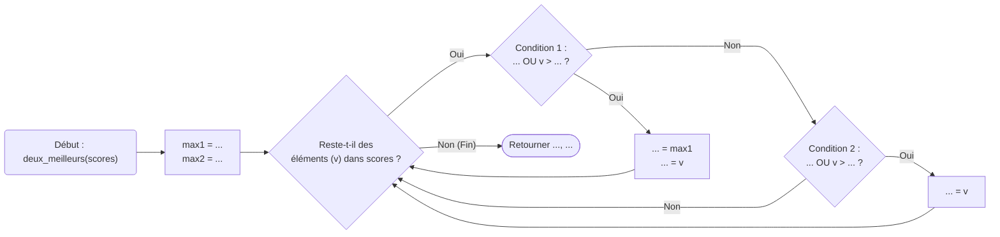

---
author:
    - Guillaume Connan
    - Romain Janvier
    - Nicolas Revéret
hide:
    - navigation
    - toc
title: Les deux meilleurs
tags:
    - à trous
    - booléen
difficulty: 170
---

Vous venez de développer *Flap Flap Bird*, un jeu très dur où il faut
aider un oiseau à éviter des obstacles. À la fin de la partie, vous enregistrez le score du joueur
et vous souhaitez afficher ses deux meilleurs scores. Ceux-ci peuvent être égaux.

On considère les deux listes de scores suivants :

* `#!py scores_1 = [13, 15, 12, 3, 19, 7, 14]`

* `#!py scores_2 = [27, 35, 14, 35, 3, 26, 9]`

Pour `score_1`, les deux meilleurs scores sont `#!py 19` et `#!py 15`. Pour `score_2`, ce sont `#!py 35` et `#!py 35`.

Il est possible que la liste de score contienne moins de deux valeurs.
Dans ce cas, les meilleures valeurs sont remplacées par `#!py None`.

Compléter le code de la fonction `deux_meilleurs` qui prend une liste d'entiers `scores` et renvoie :

* le couple formé par les deux meilleures valeurs `max1` et `max2` avec `max1` ≥ `max2` si la liste contient au moins deux scores ;

* le couple `(max1, None)` où `max1` est le score maximal si la liste ne contient qu'un seul score ;

* le couple `(None, None)` si la liste est vide.

Ce schéma explique comment l'algorithme fonctionne :



!!! warning "Contraintes"

    On n'utilisera ni `max`, ni `min`, ni `sort`, ni `sorted`.

??? tip "Aide"

    Il s'agit d'une recherche de *maximum* originale car on cherche les **deux** valeurs maximales.

    On pourra débuter l'algorithme en affectant la valeur `#!py None` aux variables `max1` et `max2` puis en parcourant les scores.
    Pour chacun d'entre eux on mettra à jour, si besoin, l'une des variables (ou les deux).

    La question principale est donc de savoir quand mettre à jour `max1`, `max2` et les deux ?

??? info "La valeur `#!py None`"

    `#!py None` est une valeur spéciale utilisée en Python et qui correspond
    à un manque de valeur *normale*. Lorsque l'exécution d'une fonction
    se termine sans avoir rencontré un `return`, Python renvoie
    automatiquement la valeur `#!py None`.

    On peut tester si une variable `x` contient la valeur `#!py None` de la
    manière suivante :
    ```python
    if x is None:
        ...
    ```
    On pourrait également tester `x == None` mais si `x` est un objet
    d'une classe dans laquelle l'égalité a été redéfinie, l'égalité peut
    être vraie, alors que `x is None` ne l'est pas.

???+ example "Exemples"

    ```pycon title=""
    >>> scores_1 = [13, 15, 12, 3, 19, 7, 14]
    >>> deux_meilleurs(score_1)
    (19, 15)
    >>> scores_2 = [27, 35, 14, 35, 3, 26, 9]
    >>> deux_meilleurs(score_2)
    (35, 35)
    >>> deux_meilleurs([4, 5])
    (5, 4)
    >>> deux_meilleurs([5, 4])
    (5, 4)
    >>> deux_meilleurs([5, 5])
    (5, 5)
    >>> deux_meilleurs([9])
    (9, None)
    >>> deux_meilleurs([])
    (None, None)
    ```

{{ IDE('exo', MAX=1000) }}
