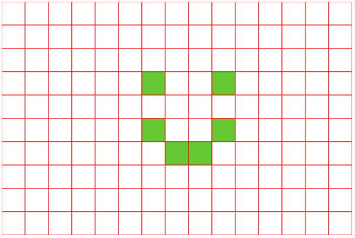
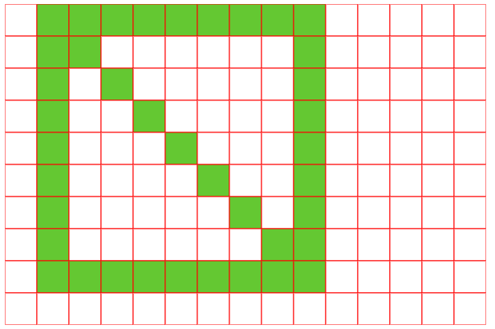

# Exercices d'entraînement sur les listes

??? question "Exercice 1 : Les pays de l'Union Européenne"
    On vous donne la liste des pays de l'Union européenne (UE), ainsi que la liste des capitales correspondantes et la liste des nombres d'habitants (en millions d'habitants).
    
    ```python
    pays = ['Allemagne', 'Autriche', 'Belgique', 'Bulgarie', 'Chypre', 'Croatie', 'Danemark', 'Espagne', 'Estonie', 'Finlande',
            'France', 'Grèce', 'Hongrie', 'Irlande', 'Italie', 'Lettonie', 'Lituanie', 'Luxembourg', 'Malte', 'Pays-Bas', 
            'Pologne', 'Portugal', 'République tchèque', 'Roumanie', 'Slovaquie', 'Slovénie', 'Suède']
    capitale = ['Berlin', 'Vienne', 'Bruxelles', 'Sofia', 'Nicosie', 'Zagreb', 'Copenhague', 'Madrid', 'Tallinn', 'Helsinki',
               'Paris', 'Athènes', 'Budapest', 'Dublin', 'Rome', 'Riga', 'Vilnius', 'Luxembourg', 'La Valette', 'Amsterdam',
               'Varsovie', 'Lisbonne', 'Prague', 'Bucarest', 'Bratislava', 'Ljubljana', 'Stockholm']
    population = [83.16, 8.98, 11.75, 6.45, 0.90, 3.85, 5.93, 47.43, 1.37, 5.56,
                 68.4, 10.71, 9.60, 5.27, 58.98, 1.88, 2.9, 0.66, 0.54, 17.81,
                 36.7, 10.5, 10.7, 19.06, 5.43, 2.11, 10.45]
    ```
    
    Répondre aux questions suivantes en écrivant un petit programme en Python (les listes sont déjà chargées dans l'environnement de la console, vous n'avez pas besoin de les redéfinir).
    
    1. Combien y a-t-il de pays dans l'UE ?
    {{ IDE('scripts/ex1_1') }}

    2. Quel est le nombre total d'habitants de l'UE ? (l'utilisation de la fonction `sum` n'est pas autorisée)
    {{ IDE('scripts/ex1_2') }}

    3. Quel est le pays le plus peuplé de l'UE ? (l'utilisation de la fonction `max` n'est pas autorisée)
    {{ IDE('scripts/ex1_3') }}

    4. Quel est le pays le moins peuplé de l'UE ? (l'utilisation de la fonction `min` n'est pas autorisée)
    {{ IDE('scripts/ex1_4') }}

    5. Ecrire un programme qui affiche un pays de l'UE au hasard, ainsi que sa capitale et son nombre d'habitants.
    {{ IDE('scripts/ex1_5') }}

    6. Ecrire un programme qui demande à l'utilisateur de saisir le nom d'un pays de l'UE et qui affiche la capitale de ce pays.
    {{ IDE('scripts/ex1_6') }}

??? question "Exercice 2 : Produit des éléments d'une liste"
    Ecrire une fonction `produit` qui prend en paramètre une liste d'entiers appelée `liste` et qui renvoie le produit des éléments de cette liste.

    **Exemple**: produit([2,1,3,4]) doit renvoyer 24

    {{ IDE('scripts/ex2') }}

??? question "Exercice 3 : Entrelacer deux listes"
    Ecrire une fonction `entrelace` qui entrelace les deux listes `liste1` et `liste2` données en paramètre. (Plusieurs méthodes sont envisageables).
    
    Par exemple `entrelace([4,8,6], [5,1,9])` doit renvoyer `[4,5,8,1,6,9]`.

    {{ IDE('scripts/ex3') }}

??? question "Exercice 4 : Listes définies en compréhension, filtrage d'une liste"
    1. Générer en compréhension la liste des carrés des entiers de 1 à 25 (`liste1` à générer ci-dessous).
    2. Générer en compréhension la liste des entiers de 0 à 100 qui ne sont pas divisibles par 7 (`liste2` à générer ci-dessous).   

    {{ IDE('scripts/ex4') }}

??? question "Exercice 5 : Grille"
    On crée une grille de 10 lignes et 15 colonnes, c'est-à-dire une liste de 10 listes de 15 éléments. Les éléments de cette grille seront soit 0 soit 1.
    
    1. Modifier la grille (en écrivant les 6 instructions manquantes) pour qu'elle corresponde exactement à cette image (les "1" correspondent aux cases vertes et les "0" aux cases blanches) :
    
    {: style="display: block; margin: 0 auto" }
    
    {{ IDE('scripts/ex5_1') }}

    2. Utiliser des boucles pour mettre à 1 les éléments de la grille afin d'obtenir cette configuration :
    
    {: style="display: block; margin: 0 auto" }

    {{ IDE('scripts/ex5_2') }}
