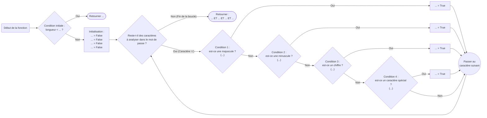

---
hide:
    - navigation
    - toc
title: Validation de mot de passe

---

Nous utilisons tous des mots de passe pour nous connecter à différentes applications sur internet.

Choisir un bon mot de passe n'est pas si simple, celui-ci doit respecter certaines règles d'améliorer sa sécurité. On propose dans cet exercices certaines règles de validation des mots de passe.

??? warning "Les règles présentées ici sont trop simples !"

    Les règles utilisées dans l'exercice sont simplifiées afin de ne pas compliquer l'algorithme.

    **Elles ne garantissent pas forcément que le mot de passe généré sera « fort »**.

    On rappelle à ce titre qu'un mot de passe fort :

    * doit compter au minimum 14 caractères,
    * doit éviter d'utiliser des mots courants du dictionnaire,
    * doit éviter d'utiliser de noms de personnes ou de marques,
    * ne doit pas contenir de dates de naissances ni de codes postaux,
    * ne doit être utilisé que pour une seule application,
    * doit, de façon générale, être facile à mémoriser pour vous mais compliqué à deviner pour une autre personne.

    Ces règles ne sont toutefois **pas exhaustives**.

    Cette [illustration](https://xkcd.com/936/) tirée du *webcomic* `xkcd` propose une méthode de construction de mot de passe « forts ».


On considère dans la suite qu'un mot de passe est *valide* s'il contient :

* au minimum 14 caractères (inclus),

* au moins une lettre majuscule,

* au moins une lettre minuscule,

* au moins un chiffre,

* au moins un caractère spécial parmi `#!py ",;:!?./§%*$£&#{}()[]-_@"` (sans les guillemets).

On demande donc d'écrire une fonction `valide` qui prend en paramètre une chaîne de caractères `mdp` et renvoie `True` si cette chaîne est un mot de passe valide, `False` dans le cas contraire.

On garantit que les chaînes de caractères `mdp` passées en argument ne contiennent que des caractères alphanumériques et des caractères spéciaux.

??? tip "Aides sur les chaînes de caractères en Python"

    Si `chaine` est une chaîne de caractères :

    * `#!py chaine.isupper()` renvoie `#!py True` si `chaine` ne contient que des caractères en majuscule, `#!py False` dans le cas contraire,
    * `#!py chaine.islower()` renvoie `#!py True` si `chaine` ne contient que des caractères en minuscule, `#!py False` dans le cas contraire,
    * `#!py chaine.isnumeric()` renvoie `#!py True` si `chaine` ne contient que des chiffres, `#!py False` dans le cas contraire.

    Ces différentes méthodes sont utilisables dans le cas où `chaine` ne contient qu'un seul caractère.

???+ example "Exemples"

    ```python
    >>> mdp = "X5j13$#eCM1cG@Kdce246gs%mFs#3tv6"  # Mot de passe valide
    >>> valide(mdp)
    True
    >>> mdp = "X5j13$#eCM"  # Trop court
    >>> valide(mdp)
    False
    >>> mdp = "5j13$#e1c@dce246gs%ms#3tv6"  # Pas de majuscule
    >>> valide(mdp)
    False
    >>> mdp = "X513$#CM1G@K246%F#36"  # Pas de minuscule
    >>> valide(mdp)
    False
    >>> mdp = "X5j13eCM1cGKdce246gsmFs3tv6"  # Pas de caractère spécial
    >>> valide(mdp)
    False
    ```
Ce diagramme permet de représenter les différentes étapes du programme :


{{ IDE('exo_vide', MAX=1000) }}
